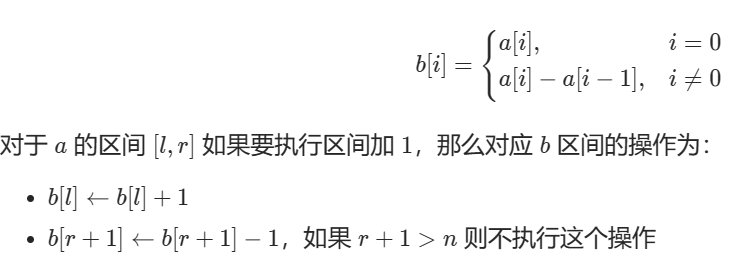
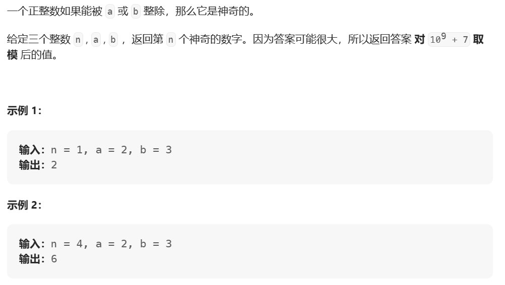
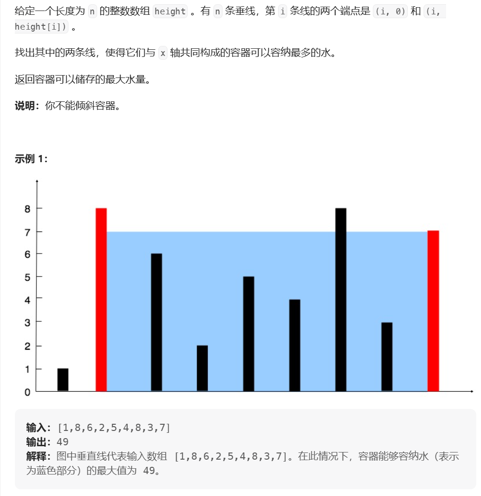
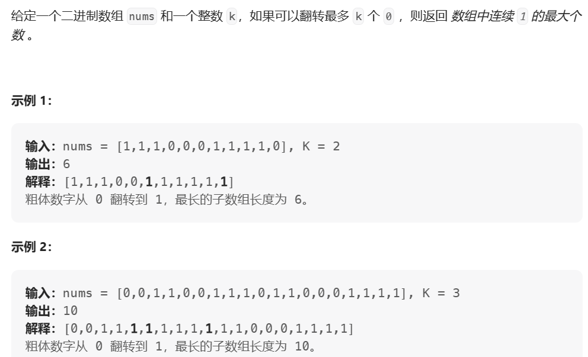
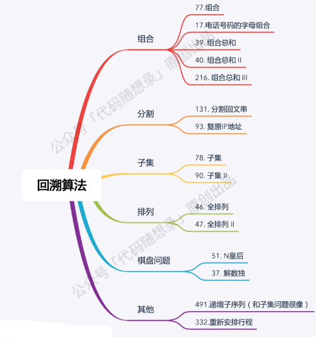
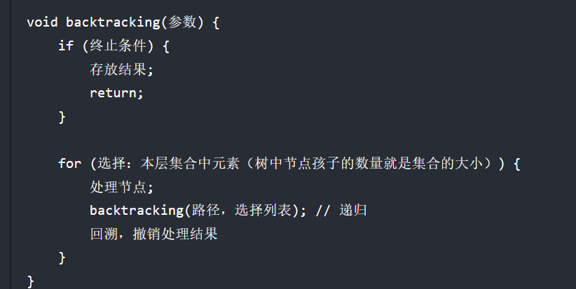
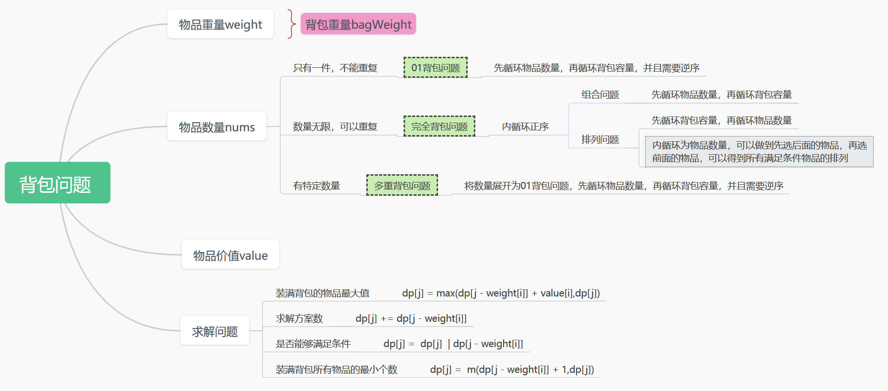
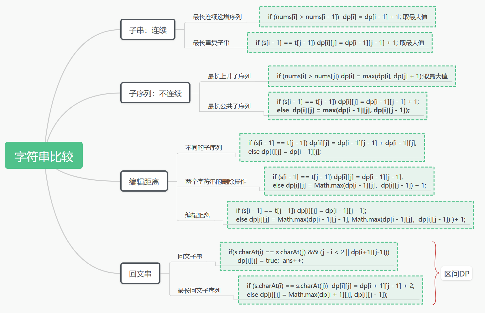

# 算法

## 1.区间求和

### ①差分数组+前缀和

[1589. 所有排列中的最大和 - 力扣（LeetCode）](https://leetcode.cn/problems/maximum-sum-obtained-of-any-permutation/)

对于每一次遍历都有`m`个数需要加`1`，如果对这些数遍历，则需要`O（m）`复杂度，此时可以记录这`m`个数的差分数组：



这样就可以把时间复杂度缩小到`O(1)`，之后求前缀和就可以得到原来的数组。

## 2.线性筛（欧拉筛）求素数

[2601. 质数减法运算 - 力扣（LeetCode）](https://leetcode.cn/problems/prime-subtraction-operation/)

```java
public int[] findPrime(int max){
    boolean[] isNotPrime = new boolean[max];//数的范围
    int[] primes = new int[n];//质数大小
    int cnt = 0;
    for( int i = 2; i < max; i++){
        if(!isNotPrime[i]) primes[cnt++] = i;
        for(int j = 0;j < cnt && primes[j] * i < max;j++){
            isNotPrime[primes[j] * i] = true;
            if(i % primes[j] == 0) break;
        }
    }
    return primes;
}
```

## 3.二分查找

[二分法的 5 种经典应用 - 力扣（LeetCode）](https://leetcode.cn/circle/article/huweDm/)

### ①求边界

[2563. 统计公平数对的数目 - 力扣（LeetCode）](https://leetcode.cn/problems/count-the-number-of-fair-pairs/)

**技巧：**

> 求一个数在区间[left，right]时，可以转化为：(<=right) -  (<= left - 1)
>
> 求两个数之和在区间[left，right]时，可以转化为：
>
> ​	遍历其中一个数num1，求(<=right - num1) -  (<= left - num1 - 1)

```java
//普通的二分查找 left = -1; right = length; 开区间
public int binarySort(int[] nums, int left, int right, int value){
    while(left + 1 < right) {
        int mid = (left + right) >>> 1;
        if(value < nums[mid]){
            right = mid;
        } else if (value == nums[mid]) {
            return mid;
        } else{
            left = mid;
        }
    }
    return -1;
}	

//通用模板>= 
//left = -1; right = length; 开区间
public int binarySearch(int[] nums, int left, int right, int value){
    while(left + 1 < right) {
        int mid = (left + right) >>> 1;
        if(value <= nums[mid]){
            right = mid;
        }  else{
            left = mid;
        }
    }
    return right;
}
//求>: binarySort(nums,left,right,value + 1);
//求<: binarySort(nums,left,right,value) - 1;
//求<=: binarySort(nums,left,right,value + 1) - 1;
```

### ②最大化最小值/最小化最大值

[2517. 礼盒的最大甜蜜度 - 力扣（LeetCode）](https://leetcode.cn/problems/maximum-tastiness-of-candy-basket/)

[2439. 最小化数组中的最大值 - 力扣（LeetCode）](https://leetcode.cn/problems/minimize-maximum-of-array/)

### ③第k大/第k小

[668. 乘法表中第k小的数 - 力扣（LeetCode）](https://leetcode.cn/problems/kth-smallest-number-in-multiplication-table/)

**以上两种的思路：**

利用二分查找符合条件的数，根据是否满足题意来收缩数的范围！

[878. 第 N 个神奇数字 - 力扣（Leetcode）](https://leetcode.cn/problems/nth-magical-number/)



**题解：**

根据容斥原理，给定一个能被a或b整除的数num：

`n =  num/a + num/b - num/(a和b的最小公倍数)`

所以该题目可以利用二分查找，通过容斥原理计算对应第几个神奇数字，如果该数大于预期的n，则缩小数的范围继续进行二分查找。

```java
class Solution {
    public int nthMagicalNumber(int n, int a, int b) {
        long left = Math.min(a,b);
        long right = (long)n * Math.min(a,b);

        while(left + 1 < right){
            long mid = (left + right) >>> 1;
            long cnt = mid / a + mid / b - mid * greatestCommonDivisor(a,b)/(a * b);
            if(cnt >= n){
                right = mid;//缩小数的范围
            }else{
                left = mid;
            }
        }
        return (int)(right % 1000000007L);
    }
    private int greatestCommonDivisor(int a, int b){//最小公倍数
        int r = Math.max(a,b);
        int l = Math.min(a,b);
        while(l != 0){
            int temp = l;
            l = r % l;
            r = temp;
        }
        return r;
    }
}
```

## 4.双指针

### ①相向指针

[11. 盛最多水的容器 - 力扣（Leetcode）](https://leetcode.cn/problems/container-with-most-water/description/)

 

**题解：**

利用双指针从数组两侧向中间靠拢，根据两端线的长度进行收缩，以`left > right`为例，有两种情况：

> ①如果移动left指针，容量可能会变小（移动后的left < right）或者不变（移动后的left >=right）；
>
> ②如果移动right指针，容量可能会变大（移动后的right > 原来的right）、变小（移动后的right < 原来的right）或者不变（移动后的right不变）；

所以要想求得最优解，可以通过移动线的长度较小的那一段，求所有面积的最大值即可。

```java
class Solution {
    public int maxArea(int[] height) {
        int left = 0;
        int right = height.length - 1;
        int maxArea = -1;
        while(left < right){
            int area = (right - left) * Math.min(height[left], height[right]);
            maxArea = Math.max(maxArea,area);
            if(height[left] < height[right]){//缩小线段长度比较小的那一段
                left++;
            }else{
                right--;
            }
        }
        return maxArea;
    }
}
```

### ②滑动窗口

[1004. 最大连续1的个数 III - 力扣（Leetcode）](https://leetcode.cn/problems/max-consecutive-ones-iii/description/)

 

## 5.贪心算法

## 6.回溯

回溯一般用来解决的问题：



回溯模板：`for`循环控制树的宽度，递归控制树的深度



### ①组合回溯

如果是一个集合来求组合的话，就需要`startIndex`。

例如：[77.组合 (opens new window)](https://programmercarl.com/0077.组合.html)，[216.组合总和III (opens new window)](https://programmercarl.com/0216.组合总和III.html)。

如果是多个集合取组合，各个集合之间相互不影响，那么就不用startIndex。

例如：[17.电话号码的字母组](https://programmercarl.com/0017.电话号码的字母组合.html)

### ②子集回溯

组合/分割回溯在树的叶子节点取结果，子集回溯在每个节点都取结果。

### ③排列回溯

不需要`startIndex`，每次都是从`0`开始。


去除重复情况：

- 树同一层剪枝；
- 树同一枝剪枝。

## 7.动态规划

### ①背包问题



### ②字符串对比问题



### ③树形DP

[337. 打家劫舍 III - 力扣（LeetCode）](https://leetcode.cn/problems/house-robber-iii/)

### ④状态机DP

可以给01背包问题加上一个情景，**不能选择相邻的物品**。此时如果还按照我们之前的做法，用`f[i][j]`来定义的话，你对某个物品的具体状态是模糊的。我们一般是用`f[i-1][j]`和`f[i-1][j-v]+w`来写转移方程，但是你无法判断第`i-1`个物品是否在背包里，也就是说你不知道第`i-1`个物品所处的状态。

但是此时如果按照状态机模型来写，特意强调一下某个物品的状态，我们就可以添加第三维度的`0`和`1`来判断能否选当前的物品。

因此，当某个事件的状态影响到后面事件的决策的时候，我们可能需要在状态定义的时候记录事件状态，即状态机DP。

[309. 买卖股票的最佳时机含冷冻期 - 力扣（LeetCode）](https://leetcode.cn/problems/best-time-to-buy-and-sell-stock-with-cooldown/)

### ⑤区间DP

[516. 最长回文子序列 - 力扣（LeetCode）](https://leetcode.cn/problems/longest-palindromic-subsequence/description/)

## 8.图算法

### ①DFS

- 网格类DFS：

```java
// 方向数组，分别代表上、下、左、右
int[][] dirs = new int[][]{{-1,0}, {1,0}, {0,-1}, {0,1}};

void dfs(int[][] grid, int i, int j, boolean[] visited) {
    int m = grid.length, n = grid[0].length;
    if (i < 0 || j < 0 || i >= m || j >= n) {
        // 超出索引边界
        return;
    }
    if (visited[i][j]) {// 已遍历过 (i, j)
        return;
    }

    // 进入节点 (i, j)
    visited[i][j] = true;
    // 递归遍历上下左右的节点
    for (int[] d : dirs) {
        int next_i = i + d[0];
        int next_j = j + d[1];
        dfs(grid, next_i, next_j);
    }
}
```

岛屿系列题目。

- 图类DFS：

```java
Graph graph;
boolean[] visited;

void traverse(Graph graph, int s) {
    if (visited[s]) return;
    // 经过节点 s
    visited[s] = true;
    for (TreeNode neighbor : graph.neighbors(s))
        traverse(neighbor);
    // 离开节点 s
    visited[s] = false;   
}
```

与回溯差不多。

### ②BFS

利用队列，一般用来求最短路径/最小次数。

```java 
// 计算从起点 start 到终点 target 的最近距离
int BFS(Node start, Node target) {
    Queue<Node> q; // 核心数据结构
    Set<Node> visited; // 避免走回头路

    q.offer(start); // 将起点加入队列
    visited.add(start);
    int step = 0; // 记录扩散的步数

    while (q not empty) {
        int sz = q.size();
        /* 将当前队列中的所有节点向四周扩散 */
        for (int i = 0; i < sz; i++) {
            Node cur = q.poll();
            /* 划重点：这里判断是否到达终点 */
            if (cur is target)
                return step;
            /* 将 cur 的相邻节点加入队列 */
            for (Node x : cur.adj())
                if (x not in visited) {
                    q.offer(x);
                    visited.add(x);
                }
        }
        /* 划重点：更新步数在这里 */
        step++;
    }
}
```

如果知道终点是什么，可以使用双向BFS进行优化。

```java
// 计算从起点 start 到终点 target 的最近距离
int BiBFS(Node start, Node target) {
    Set<Node> s1; // 核心数据结构
    Set<Node> s2;
    Set<Node> visited; // 避免走回头路

    s1.add(start); // 将起点加入
    s2.add(target); //将终点加入
    visited.add(start);
    int step = 0; // 记录扩散的步数

    while (s1 not empty && s2 not empty) {
        Set<Node> temp;
        /* 将当前队列中的所有节点向四周扩散 */
        for (Node cur : s1) {
            /* 划重点：这里判断是否相交 */
            if (s2 contains cur)
                return step;
            //如果扩散过程中添加，则两个集合永远不会相交
            visited.add(x);
            /* 将 cur 的相邻节点加入队列 */
            for (Node x : cur.adj())
                if (x not in visited) {
                    temp.add(x);
                }
        }
        /* 划重点：更新步数在这里 */
        step++;
        s1 = s2;
        s2 = temp;//temp是根据s1扩散得到的，这部分相当于交换集合
        //也可以通过比较s1s2的size选择较小的进行扩散
    }
}
```

# 数据结构

## 1.单调栈

常见用途：

> 向左/右找第一个比自身大/小的数

[739. 每日温度 - 力扣（LeetCode）](https://leetcode.cn/problems/daily-temperatures/description/)

## 2.并查集

```java
class UnionFind{
    private static int[] father;
    private void init(n){
        father = new int[n];
        for (int i = 0; i < n; i++) {
            father[i] = i;
        }
    }
    private void union(int u,int v){
        u = find(u);
        v = find(v);
        if(u == v) return;
        father[v] = u;
    }
    private int find(int u){
        return u == father[u] ? u :
        (father[u] = find(father[u]));
    }
    private boolean isSame(int u,int v){
        u = find(u);
        v = find(v);
        return u == v;
    }
}
```

